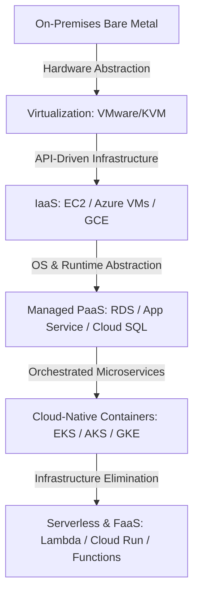

# Cloud Fundamentals & Architectural Primitives

## Overview

Cloud computing fundamentally alters the mental models of systems architecture. Moving from traditional physical data centers to hyper-scale public clouds is not simply a hosting migration; it shifts constraints around failure domains, provisioning latency, security boundaries, and operational economics.

---

## Core Modules

1. **[Architectural Shifts](architectural-shifts.md)**: How the transition to cloud redefines scalability, elasticity, cattle vs pets, and failure tolerance.
2. **[Service Models](service-models.md)**: Deep architectural comparison of IaaS, PaaS, SaaS, FaaS, and Managed Services.
3. **[Shared Responsibility Model](shared-responsibility-model.md)**: Exact demarcation of security, compliance, operational, and data responsibilities between tenant and provider.
4. **[Regions & Availability Zones](regions-and-availability-zones.md)**: Physical infrastructure topology, fault domains, latency envelopes, and edge Points of Presence (PoPs).
5. **[Control Plane vs Data Plane](control-plane-vs-data-plane.md)**: Architectural separation of administrative management planes from real-time request paths; survivability during control plane outages.
6. **[Managed vs Self-Managed](managed-vs-self-managed.md)**: Decision framework for evaluating whether to purchase cloud-native managed services or run self-hosted OSS instances.
7. **[Cloud Operating Model](cloud-operating-model.md)**: Moving from ticket-based IT operations to product-led internal developer platforms (IDP).
8. **[Cloud Failure Domains](cloud-failure-domains.md)**: Categorization of systemic failure modes: rack, power, AZ, region, fiber cut, DNS poisoning, and IAM global replication failure.
9. **[Evolution Spectrum](evolution-spectrum.md)**: Navigating the continuum: On-Premises → Virtualized → IaaS → Managed PaaS → Cloud-Native → Serverless.

---

## Architectural Abstraction Continuum

