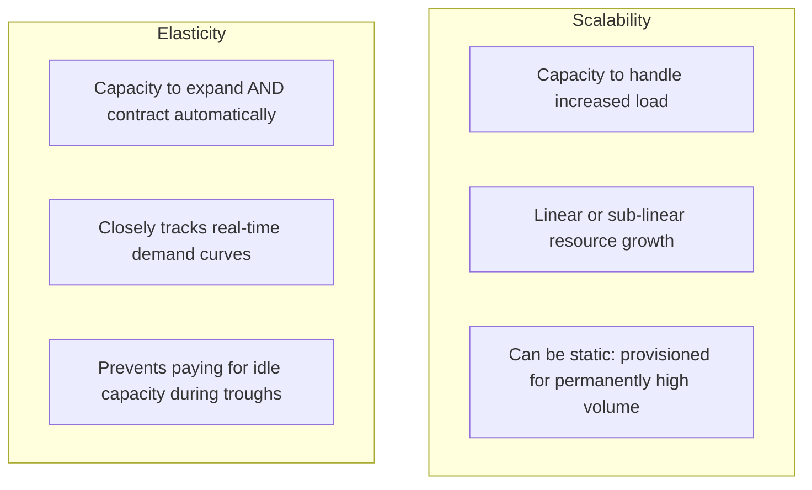

# Architectural Shifts in Cloud Computing

## Executive Summary

Cloud computing is not "someone else's computer." Treating cloud as a remote colocation facility leads to astronomical costs, brittle architectures, and severe operational fragility. Architects must adapt five fundamental mental model shifts when designing for cloud environments.

---

## 1. The Five Fundamental Shifts

| Dimension | Traditional On-Premises Architecture | Modern Cloud Architecture |
| :--- | :--- | :--- |
| **Capacity Management** | **Static & Peak-Provisioned**: Hardware ordered 6 months in advance for 3-year peak load. Capital expenditure (CapEx). | **Dynamic & Elastic**: Capacity provisioned horizontally via software APIs in seconds. Operational expenditure (OpEx). |
| **Component Lifecycle** | **Pets**: Hand-crafted, meticulously patched, long-lived individual servers with unique hostnames. | **Cattle**: Ephemeral, disposable, immutable compute instances instantiated from automated golden images. |
| **Failure Assumption** | **MTBF (Mean Time Between Failures)**: Engineering high-end redundant hardware (dual power supplies, SANs) to prevent any failure. | **MTTR (Mean Time To Recovery)**: Assuming commodity hardware, disks, and racks fail continuously; designing self-healing software. |
| **Security Perimeter** | **Castle-and-Moat**: Hard network perimeter (firewalls, DMZ), soft trusted internal corporate network. | **Zero Trust Identity**: Identity is the perimeter; every request is authenticated, authorized, and encrypted in transit (mTLS). |
| **Provisioning Model** | **Ticket-Driven Manual Hand-offs**: Storage team, network team, and DBA team execute manual configuration scripts. | **Declarative API-Driven GitOps**: Self-service infrastructure declared in version-controlled IaC code and deployed via automated CI/CD. |

---

## 2. Elasticity vs Scalability

A common architectural error is conflating scalability with elasticity.

### Architectural Formula for Elastic Efficiency
$$	ext{Elastic Waste} = \int_{t_0}^{t_1} (	ext{Provisioned Capacity}(t) - 	ext{Actual Demand}(t)) \, dt$$

In on-premises systems, $	ext{Provisioned Capacity}$ is a horizontal line set at the historical maximum peak plus 30% headroom, resulting in massive wasted spend during off-peak hours. In cloud architecture, autoscaling policies must match the demand curve dynamically while accommodating application cold-start and warmup latencies.

---

## 3. Designing for Disposable Infrastructure

To exploit cloud elasticity, workloads must adhere to the **Twelve-Factor App** principles:
1. **Stateless Processes**: State must be externalized into managed databases (e.g., PostgreSQL, DynamoDB) or distributed caches (Redis), never pinned to local instance storage.
2. **Fast Startup & Graceful Shutdown**: Applications must bootstrap in seconds and respond immediately to `SIGTERM` signals (e.g., draining connections within 30 seconds during spot instance termination).
3. **Immutable Deployments**: Never SSH into a running production instance to patch code or configurations. Destroy the instance and roll forward with an updated immutable container image or AMI.
