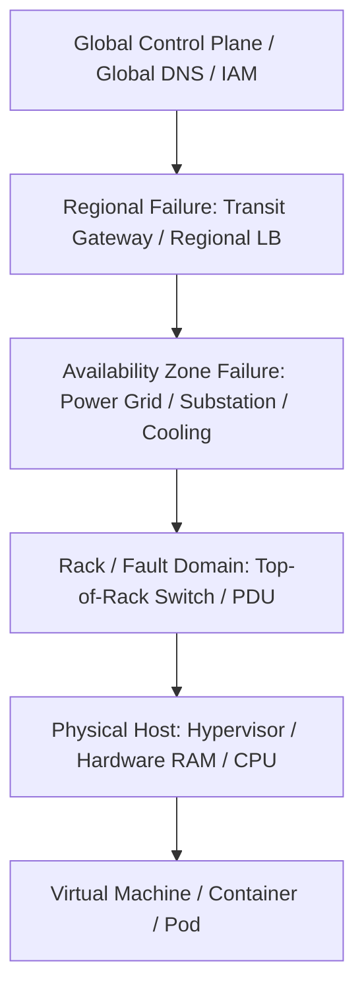

# Cloud Failure Domains & Blast Radius Management

## Executive Summary

Failures in cloud environments are inevitable and non-deterministic. A resilient enterprise architecture models failure domains explicitly, ensuring that a catastrophe at any layer is contained within a predictable blast radius.

---

## 1. Cloud Failure Domain Hierarchy

### Failure Domain Analysis & Mitigation

| Failure Tier | Example Trigger | Impacted Scope | Architectural Containment Strategy |
| :--- | :--- | :--- | :--- |
| **Physical Host** | Bad memory DIMM, kernel panic, hypervisor crash | Single VM or localized container instances | Automated hypervisor auto-recovery; Kubernetes pod rescheduling across nodes. |
| **Fault Domain / Rack** | PDU failure, Top-of-Rack switch flap | 20–40 physical servers in a single data center row | Spread placement groups; anti-affinity rules preventing co-locating replicas on the same rack. |
| **Availability Zone** | Substation explosion, major fiber conduit sever, cooling loss | Entire data center cluster (all compute, storage, local networking) | Multi-AZ active-active deployment; synchronous quorum replication across 3 AZs. |
| **Regional Failure** | Major storm, submarine cable cut, regional control plane outage | All AZs in a single geographic territory | Cross-region asynchronous replication; multi-region active-passive failover. |
| **Global Control Plane** | Global IAM replication bug, global DNS hijacking/poisoning | Worldwide customer platform | Decoupled regional cell-based architectures; local credential caching; secondary DNS providers. |

---

## 2. Blast Radius Containment Principles

1. **Cell-Based Architecture**: Partition large-scale platforms into independent, self-contained "cells" (e.g., 50,000 users per cell). A failure in one cell impacts only 2% of the user base, preventing systemic global collapse.
2. **Account / Subscription Isolation**: Never run production and non-production workloads in the same cloud account. Separate development, testing, staging, and production into dedicated AWS accounts or Azure subscriptions to prevent IAM misconfigurations or resource starvation from leaking across environments.
