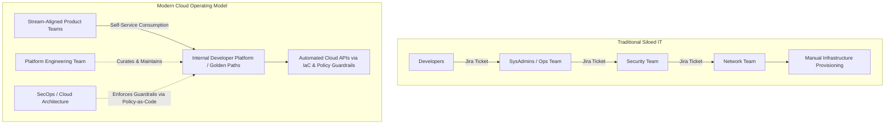

# The Cloud Operating Model

## Executive Summary

Adopting cloud infrastructure without modernizing the organizational operating model produces an "anti-cloud": a slow, expensive platform where provisioning a virtual machine takes six weeks due to manual ticketing hand-offs. The Cloud Operating Model aligns team topologies, governance, and technology delivery.

---

## 1. The Evolution of Infrastructure Operations

---

## 2. Core Tenets of the Modern Cloud Operating Model

### 1. Shift from Gatekeepers to Guardrail Builders
Traditional architecture and security teams reviewed Word documents and issued manual approvals. Modern cloud teams write **Policy as Code** (OPA, AWS SCPs, Azure Policies) that automatically prevent insecure deployments at the PR stage, eliminating human bottlenecks.

### 2. Infrastructure as a Product
The platform engineering team treats infrastructure as an internal product. Their customers are the software engineers. Success is measured by developer productivity, deployment frequency, mean time to restore (MTTR), and platform adoption rates.

### 3. Golden Paths
Provide standardized, pre-approved architectural templates ("Golden Paths") for common workload patterns:
- Standard containerized web service (with built-in CI/CD, logging, metrics, tracing, IAM, and TLS).
- Standard event consumer (with dead-letter queues, backoff policies, and alarms).
- Developers who follow the Golden Path receive automated compliance approval and zero-friction deployment.
