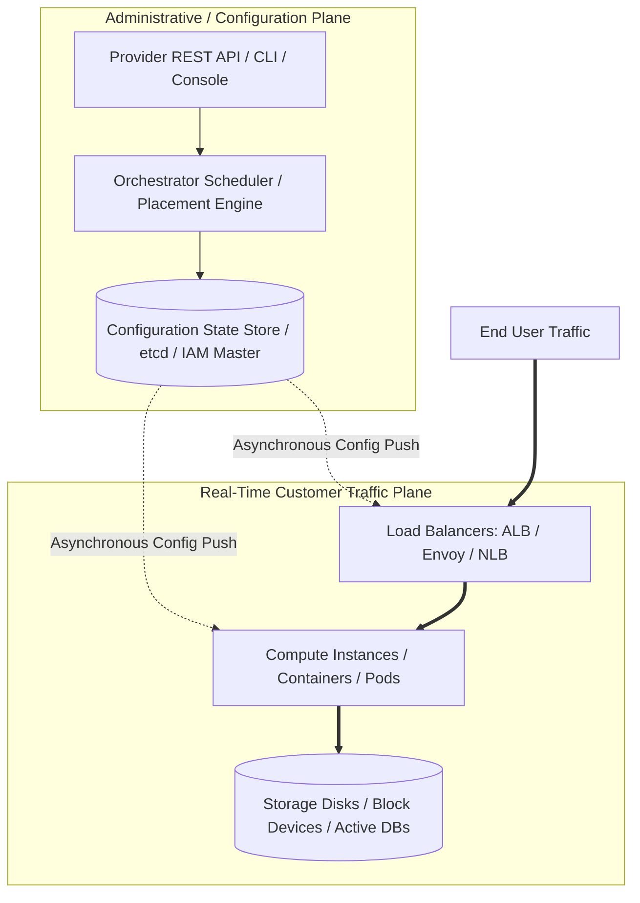

# Control Plane vs Data Plane Architecture

## Executive Summary

One of the most critical architectural distinctions in cloud platforms is the strict separation between the **Control Plane** and the **Data Plane**. Designing enterprise platforms that survive cloud provider outages requires understanding how these planes interact and ensuring data planes operate independently during control plane degradation.

---

## 1. Architectural Distinction

| Dimension | Control Plane | Data Plane |
| :--- | :--- | :--- |
| **Primary Function** | Managing state, provisioning resources, modifying routes, creating IAM policies, triggering scaling. | Processing real-time network packets, executing transactions, serving client HTTP requests, reading/writing disk blocks. |
| **Traffic Volume** | Low frequency, bursty administrative calls (1–100 requests/sec). | Extremely high throughput, continuous volume (thousands to millions of requests/sec). |
| **Latency Tolerance** | High tolerance (100 ms to several seconds is acceptable). | Ultra-low tolerance (sub-millisecond to low milliseconds required). |
| **Failure Implication** | Administrators cannot create new VMs or change firewall rules; deployment pipelines stall. | End-user transactions fail; business operations halt; direct revenue loss. |

---

## 2. The Survivability Rule: Static Stability

> **Static Stability**: A system is statically stable when its data plane continues to operate correctly and serve existing client traffic even if its control plane is completely unavailable.

### Architectural Patterns for Static Stability

1. **Pre-Provisioned Capacity**: Do not design auto-scaling policies that rely on instantaneous EC2 or GCE instance spinning to handle normal peak traffic. If the provider's compute control plane degrades, auto-scaling calls will fail. Maintain baseline headroom.
2. **Local Configuration Caching**: Compute nodes and proxy gateways must cache routing tables, DNS records, and IAM authorization tokens locally. If the remote IAM or configuration server is unreachable, the data plane must validate requests using cached public keys and tokens.
3. **Decoupled Deployments**: If an incident impairs the cloud provider's API (e.g., AWS EC2 RunInstances failing), pause CI/CD deployments immediately. Do not trigger rollbacks or blue/green switchovers that rely on control plane provisioning.
4. **Kubernetes Kube-Apiserver Degradation**: Worker nodes running Kubelet and existing Pods must continue routing traffic via kube-proxy/IPVS even if the master control plane (kube-apiserver/etcd) is temporarily unreachable.
