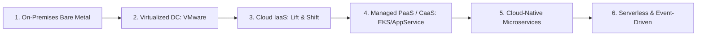

# The Enterprise Infrastructure Evolution Spectrum

## Executive Summary

Enterprise infrastructure evolves across a continuum of abstraction. Understanding where an existing workload sits on this spectrum—and where its target architecture should reside—is foundational to cloud migration and modernization.

---

## 1. Detailed Stage Evaluation

| Spectrum Stage | Operational Model | Primary Business Value | Primary Architectural Risk |
| :--- | :--- | :--- | :--- |
| **1. On-Premises Bare Metal** | Physical racking, cabling, SAN zoning, manual maintenance | Direct hardware control, zero multi-tenancy virtualization jitter | Enormous lead times (months), high fixed CapEx, rapid obsolescence |
| **2. Virtualized DC (VMware/KVM)** | Hypervisor consolidation, centralized storage pools | Improved server utilization, faster VM cloning | Still bound to physical DC capacity, manual capacity planning |
| **3. Cloud IaaS (Rehost)** | Automated VM provisioning via cloud APIs, cloud block storage | Rapid exit from aging DCs, zero application refactoring | "Lift-and-shift" preserves technical debt; high idle cloud costs |
| **4. Managed PaaS / CaaS (Replatform)**| Containerized workloads on managed clusters (EKS/AKS) or PaaS | Automated OS patching, integrated scaling, lower operational toil | Incomplete operational maturity; complex Kubernetes debugging |
| **5. Cloud-Native Microservices** | Domain-driven microservices, service mesh, distributed tracing | Independent team deployment velocity, granular scaling | Distributed systems complexity, network latency, data consistency challenges |
| **6. Serverless (Refactor)** | Pure event-driven FaaS, managed NoSQL, zero server management | Zero cost for idle workloads, instant scaling, hyper-fast time-to-market | Cold starts, vendor lock-in, complex local testing, distributed debugging |

---

## 2. The Migration Rule: Do Not Skip Stages Without Justification

Attempting to migrate a legacy, stateful on-premises monolith directly to a distributed event-driven serverless architecture in a single leap almost always fails. It demands simultaneous mastery of containerization, event-driven design, distributed data consistency, and modern CI/CD.

**Recommended Evolution Path**:
$$	ext{Monolith on VMs} \longrightarrow 	ext{Modular Monolith in Containers} \longrightarrow 	ext{Managed Kubernetes / PaaS} \longrightarrow 	ext{Selective Microservices / Serverless}$$
