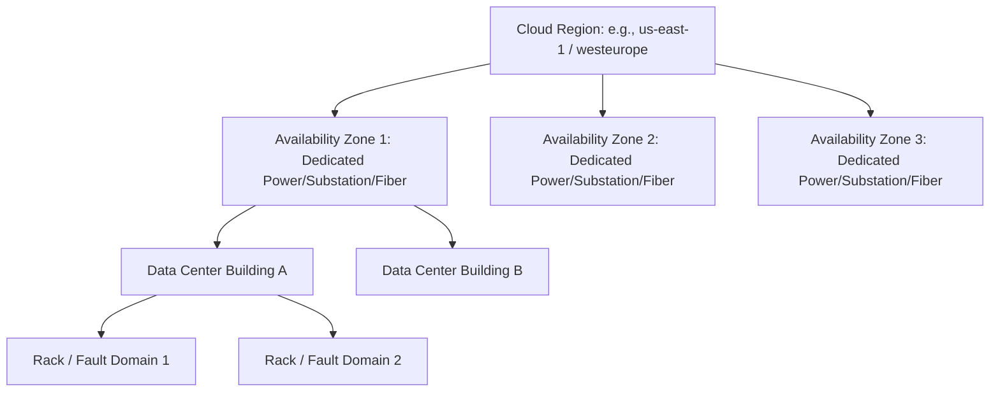

# Cloud Regions, Availability Zones, and Fault Domains

## Executive Summary

Enterprise cloud topology is structured hierarchically into **Regions**, **Availability Zones (AZs)**, **Fault Domains**, and **Edge Locations**. Designing high-availability systems requires understanding the physical characteristics, latency envelopes, and failure correlation risks of each tier.

---

## 1. Physical Infrastructure Hierarchy

### Infrastructure Hierarchy Definitions

1. **Region**: A distinct geographic area containing a minimum of three isolated Availability Zones connected via a private low-latency fiber network. Minimum physical separation between regions is typically hundreds of miles to protect against regional disasters (hurricanes, earthquakes, civil conflict).
2. **Availability Zone (AZ)**: One or more discrete data center facilities equipped with redundant power supplies, diesel generators, municipal water feeds, and cooling infrastructure. AZs are separated by distances of 10 to 60 miles to ensure physical isolation from localized floods or power grid failures while maintaining sub-2-millisecond round-trip latency.
3. **Fault Domain**: A group of physical server racks sharing a common power distribution unit (PDU) and top-of-rack (ToR) network switch. Virtual machines distributed across distinct fault domains will not fail simultaneously due to a single power breaker or switch failure.
4. **Edge Locations / Points of Presence (PoP)**: Hundreds of globally distributed caching and transit nodes connected to the cloud provider's private global fiber backbone. They terminate client TLS sessions, cache static content, and run lightweight compute close to end users.

---

## 2. Latency Envelopes & Architectural Decision Constraints

| Boundary | Typical Round-Trip Latency (RTT) | Suitable Architectural Patterns | Unsuitable Architectural Patterns |
| :--- | :--- | :--- | :--- |
| **Intra-AZ (Same Subnet / Placement Group)**| $< 0.5 	ext{ ms}$ | Distributed in-memory caching, microsecond HFT, clustered HPC | Broad geo-distribution |
| **Inter-AZ (Across AZs in Same Region)**| $1.0 - 2.0 	ext{ ms}$ | Synchronous multi-AZ database replication (e.g., PostgreSQL primary/standby, Aurora quorum, Raft consensus) | Monolithic single-thread chatty RPC protocols |
| **Inter-Region (Continental, e.g., US-East to US-West)**| $60 - 80 	ext{ ms}$ | Asynchronous replication, Eventual Consistency, Active-Passive DR, Kafka MirrorMaker 2 | Synchronous 2-phase commit (2PC), synchronous distributed SQL transactions |
| **Inter-Region (Trans-Oceanic, e.g., US to Europe / Asia)**| $120 - 250 	ext{ ms}$ | Independent regional stacks, global CDN caching, asynchronous batch synchronization | Any synchronous distributed consensus protocol |

---

## 3. Availability Zone Mapping Disambiguation

Cloud providers intentionally randomize the physical-to-logical mapping of Availability Zone identifiers across customer accounts to distribute load evenly across data centers.
- In Customer Account A, `us-east-1a` may map to physical data center cluster `use1-az1`.
- In Customer Account B, `us-east-1a` may map to physical data center cluster `use1-az4`.

> **Architecture Imperative**: When designing cross-account VPC peering or shared services in an enterprise landing zone, always reference the immutable **AZ ID** (e.g., `use1-az2`), not the arbitrary logical name (`us-east-1a`), to guarantee resources reside in the identical physical facility.
