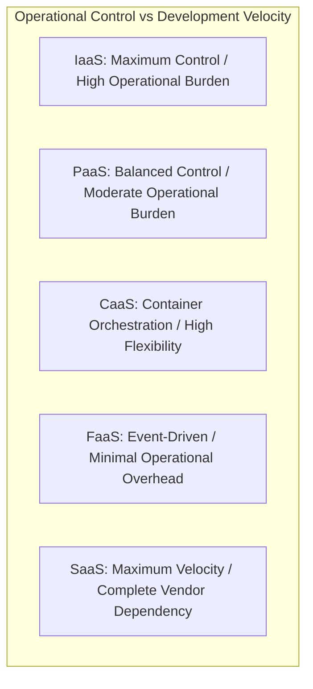

# Cloud Service Models: Architectural Trade-Offs

## Executive Summary

The choice between **IaaS**, **PaaS**, **SaaS**, **FaaS**, and **Managed Services** represents an architectural trade-off between **operational control** and **development velocity**.

---

## 1. Comparative Architecture Matrix

| Capability Layer | IaaS (e.g., EC2, Azure VM, GCE) | CaaS (e.g., EKS, AKS, GKE) | PaaS (e.g., App Service, Cloud Run) | FaaS (e.g., Lambda, Azure Functions) | SaaS (e.g., Salesforce, Auth0) |
| :--- | :--- | :--- | :--- | :--- | :--- |
| **Application Logic** | Customer | Customer | Customer | Customer | Vendor |
| **Data & Schema** | Customer | Customer | Customer | Customer | Customer / Vendor |
| **Runtime & Framework**| Customer | Customer | Vendor / Customer | Vendor | Vendor |
| **OS & Kernel Patching**| Customer | Customer / Node Group | Vendor | Vendor | Vendor |
| **Hypervisor & VM** | Vendor | Vendor | Vendor | Vendor | Vendor |
| **Physical Hardware** | Vendor | Vendor | Vendor | Vendor | Vendor |
| **Scaling Granularity**| Virtual Machines (Minutes) | Pods / Nodes (Seconds to Mins) | Containers / Requests (Seconds) | Invocations / Requests (Milliseconds) | Pure API consumption |
| **Billing Model** | Hourly / Per-Second per vCPU/RAM | Per Node + Cluster Management fee | Per container vCPU/RAM or Request | Per millisecond of execution time | Per user / Per transaction / Monthly |

---

## 2. Detailed Architectural Trade-Off Analysis

### Infrastructure as a Service (IaaS)
- **When to Use**: Legacy COTS software requiring specific Windows/Linux kernel modules; specialized hardware requirements (GPUs, custom networking appliances); non-containerized legacy monoliths during lift-and-shift migration.
- **Architectural Anti-Pattern**: Deploying greenfield microservices on raw EC2/VM instances with manual OS configuration scripts, forfeiting automated scaling, self-healing, and native service discovery.

### Platform as a Service (PaaS)
- **When to Use**: Standard web applications, REST APIs, and background workers where developers should focus purely on business logic without managing container orchestration engines or underlying host OS patches.
- **Constraints**: Limited access to underlying OS system calls; restricted networking customization (e.g., custom iptables or non-standard protocols); vendor-imposed request timeouts (e.g., 230-second gateway limits).

### Function as a Service (FaaS / Serverless)
- **When to Use**: Event-driven integrations, async queue processors, scheduled cron jobs, lightweight stateless APIs with erratic or bursty traffic profiles.
- **Constraints**: Cold start latencies (especially for JVM/.NET runtimes in private VPCs); execution time limits (e.g., AWS Lambda 15-minute ceiling); state externalization overhead; local ephemeral disk constraints.
