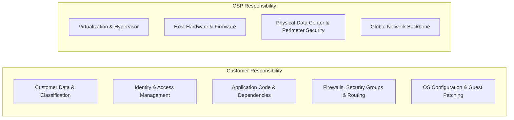

# The Cloud Shared Responsibility Model

## Executive Summary

The Shared Responsibility Model defines the division of security, regulatory, and operational obligations between the Cloud Service Provider (CSP) and the enterprise customer. Misunderstanding this model is the root cause of the vast majority of enterprise cloud security breaches.

> **Gartner Rule**: "Through 2025, 99% of cloud security failures will be the customer's fault."

---

## 1. Responsibility Demarcation Across Service Models

### Detailed Responsibility Matrix

| Responsibility Area | On-Premises | IaaS | PaaS | FaaS | SaaS |
| :--- | :--- | :--- | :--- | :--- | :--- |
| **Data Governance & Classification** | **Customer** | **Customer** | **Customer** | **Customer** | **Customer** |
| **Identity & Access Management (IAM)**| **Customer** | **Customer** | **Customer** | **Customer** | **Customer** |
| **Network Traffic Encryption & Firewalls**| **Customer** | **Customer** | **Shared** | **Shared** | **CSP** |
| **Application Vulnerabilities (OWASP)** | **Customer** | **Customer** | **Customer** | **Customer** | **CSP** |
| **Runtime & Language Updates** | **Customer** | **Customer** | **CSP** | **CSP** | **CSP** |
| **Guest OS Patching & Hardening** | **Customer** | **Customer** | **CSP** | **CSP** | **CSP** |
| **Hypervisor & Physical Server Security**| **Customer** | **CSP** | **CSP** | **CSP** | **CSP** |
| **Physical Facilities & Power/Cooling** | **Customer** | **CSP** | **CSP** | **CSP** | **CSP** |

---

## 2. Common Enterprise Architectural Traps

### Trap 1: Assuming CSP Managed Databases Handle Data-Layer Security
While AWS RDS or Azure SQL automates OS patching and disk replication, the customer is **100% responsible** for:
- Database user privilege management and role separation.
- Enforcing SSL/TLS client connection requirements (`rds.force_ssl=1`).
- Ensuring database instances reside in private subnets with strict security groups.
- Column-level data masking and application-level encryption for sensitive PII.

### Trap 2: Neglecting Software Supply Chain in Containers
Deploying a container to AWS EKS or GCP GKE does not relieve the customer of operating system patching. The base container image (Debian, Alpine, Ubuntu) contains OS packages and runtime libraries that require continuous vulnerability scanning (CVE patching) by the customer.

### Trap 3: Storage Bucket Misconfiguration
Object storage services (AWS S3, Azure Blob, Google Cloud Storage) are secure by default at the infrastructure layer, but customers routinely misconfigure IAM bucket policies or public access blocks, exposing corporate data to the public internet.
