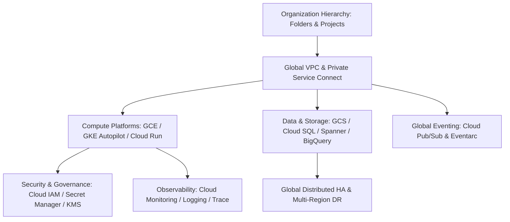

# Google Cloud Platform (GCP) Architecture

## Executive Summary

This section provides architectural blueprints and decision frameworks for designing enterprise platforms on Google Cloud Platform (GCP). GCP is architecturally distinguished by its **global network backbone**, **pioneering container infrastructure (Borg / GKE)**, and **planetary-scale data platforms (Spanner, BigQuery)**.

---

## GCP Architectural Capabilities Map

---

## Architecture Blueprints & Guides

| Capability Area | Document | Core Focus & Architectural Evaluation |
| :--- | :--- | :--- |
| **Landing Zone & Hierarchy**| **[Resource Hierarchy](resource-hierarchy.md)** | Organizations, Folders, Projects, Resource Manager |
| **Identity & Access** | **[Cloud IAM & Workload Identity](cloud-iam.md)** | Predefined vs Custom Roles, Service Accounts, Workload Identity |
| **Networking** | **[Networking & Global VPC](networking-vpc.md)** | Global VPC, Subnets, Cloud Interconnect, Private Service Connect |
| **Virtual Compute** | **[Compute Engine (GCE)](compute-engine.md)** | Managed Instance Groups (MIGs), Machine Families, Spot VMs |
| **Serverless Containers** | **[Cloud Run](cloud-run.md)** | Knative foundation, Concurrency tuning, Cold starts, VPC egress |
| **Managed Kubernetes** | **[Kubernetes: GKE](kubernetes-gke.md)** | GKE Autopilot vs Standard, Multi-cluster Services, Gateway API |
| **Serverless Functions** | **[Cloud Functions (2nd Gen)](cloud-functions.md)** | Cloud Run runtime, Eventarc triggers, Cloud Storage integration |
| **Storage Tier** | **[Storage: Cloud Storage (GCS)](storage-gcs.md)** | Multi-Region vs Regional, Autoclass lifecycle, Dual-region replication |
| **Relational Databases** | **[Databases: Cloud SQL](databases-cloud-sql.md)** | Cloud SQL for PostgreSQL/MySQL, Regional HA, Read Replicas |
| **Planetary Distributed DB**| **[Databases: Cloud Spanner](databases-cloud-spanner.md)** | TrueTime atomic clocks, Global ACID transactions, Split architecture |
| **Analytics Warehouse** | **[Analytics: BigQuery](analytics-bigquery.md)** | Serverless SQL, Compute/Storage separation, Slot reservation |
| **Global Messaging** | **[Messaging: Cloud Pub/Sub](messaging-pubsub.md)** | Global Anycast ingestion, Pull vs Push subscriptions, Ordering keys |
| **API Management** | **[API Management & Apigee](api-gateway.md)** | Apigee X enterprise gateway, API Gateway, Quota management |
| **Secrets & Encryption** | **[Security: Secret Manager & KMS](security-secret-manager.md)**| Secret Manager versions, Cloud KMS, CMEK envelope encryption |
| **Observability** | **[Observability: Cloud Operations](observability-cloud-monitoring.md)**| Cloud Monitoring, Cloud Logging, Distributed Cloud Trace |
| **Disaster Recovery** | **[Disaster Recovery Patterns](disaster-recovery.md)** | Global load balancer failover, Dual-region storage, Cross-region HA |
