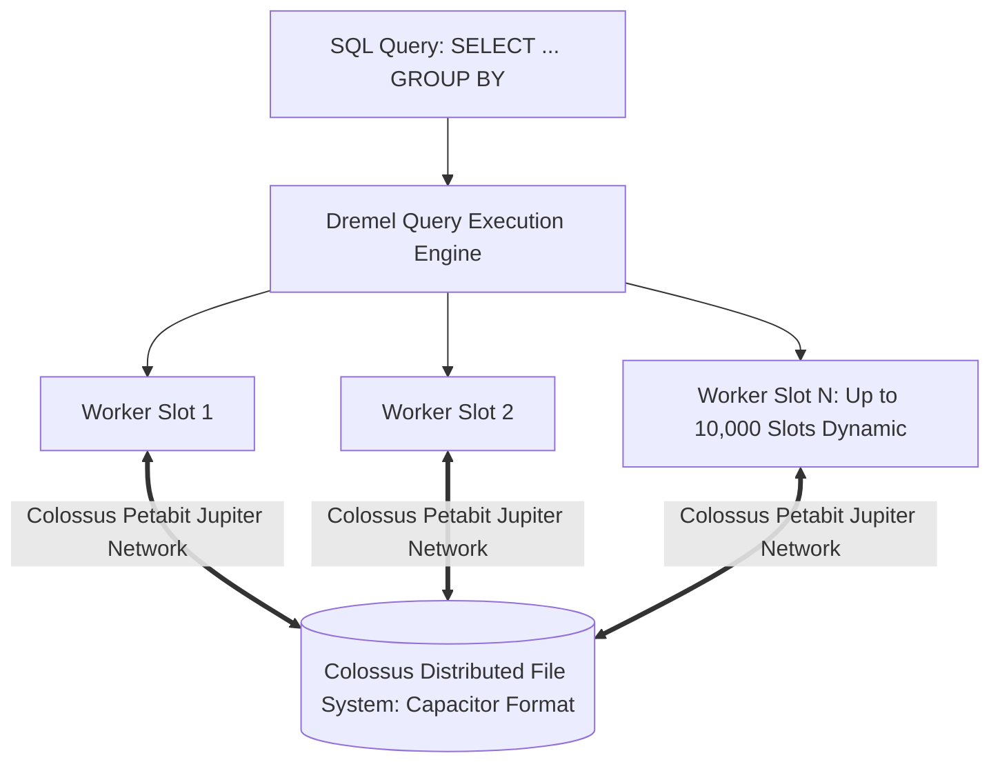

# GCP Analytical Data Architecture: BigQuery

## Executive Summary

Google BigQuery is a serverless, highly scalable, cost-effective enterprise data warehouse designed for business agility. It processes petabytes of SQL queries in seconds by decoupling compute from storage.

---

## 1. Compute and Storage Separation

---

## 2. Architectural Best Practices

1. **Partitioning and Clustering**:
   - Always partition tables by ingestion time or date column (`PARTITION BY DATE(transaction_timestamp)`).
   - Cluster tables by high-frequency query filter keys (e.g., `CLUSTER BY customer_id, region`). This enables BigQuery to prune non-matching data blocks, reducing scanned data volumes and query costs by over 90%.
2. **BigQuery Editions (Slot Reservations)**:
   - For enterprise predictability, transition from on-demand billing ($6.25 per TB scanned) to **BigQuery Standard/Enterprise Editions** with autoscaling slot reservations to cap maximum monthly analytics expenditure.
