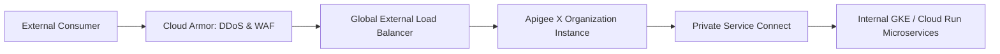

# GCP API Architecture: API Gateway & Apigee

## Executive Summary

GCP offers two primary API management solutions: **Cloud API Gateway** (lightweight serverless proxy) and **Apigee X** (full-lifecycle enterprise API platform).

---

## 1. Apigee X Enterprise Deployment Topology

---

## 2. Apigee X vs Cloud API Gateway

| Dimension | Cloud API Gateway | Apigee X Enterprise |
| :--- | :--- | :--- |
| **Architectural Role** | Simple reverse proxy for Cloud Run and Cloud Functions | Full-lifecycle API management, developer portal, monetization |
| **Policy Engine** | OpenAPI spec config (basic auth, rate limiting) | Advanced XML/JavaScript policies, OAuth 2.0, token transformation |
| **Security & Compliance**| Google IAM, API keys | Cloud Armor integration, advanced API anomaly detection, mTLS |
| **Cost Profile** | Low pay-per-call serverless pricing | High fixed monthly platform subscription ($$$) |
| **Enterprise Verdict** | Internal microservice APIs and simple webhooks | **Regulated enterprise open banking, partner ecosystems, and external APIs** |
