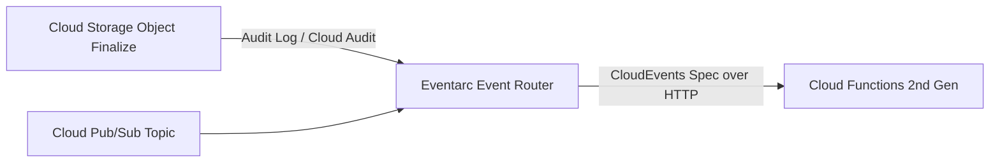

# GCP Cloud Functions (2nd Gen) Architecture

## Executive Summary

Google Cloud Functions (2nd Gen) is built on top of **Cloud Run** and **Eventarc**, providing lightweight, event-driven serverless functions with long execution timeouts and enhanced concurrency.

---

## 1. Eventarc Event-Driven Pipeline

---

## 2. Architectural Capabilities

1. **CloudEvents Standard Compliance**:
   - All events delivered to Cloud Functions adhere to the CNCF **CloudEvents v1.0** specification, ensuring standardized JSON metadata (`source`, `type`, `subject`) across all event providers.
2. **Up to 60-Minute Execution Duration**:
   - 2nd Gen functions support request timeouts up to 60 minutes for HTTP-triggered workloads, enabling complex data-processing micro-batches.
3. **Traffic Splitting for Safe Deployments**:
   - Supports native percentage-based traffic routing (e.g., 95% traffic to revision 1, 5% canary to revision 2) with automated rollback on error spikes.
