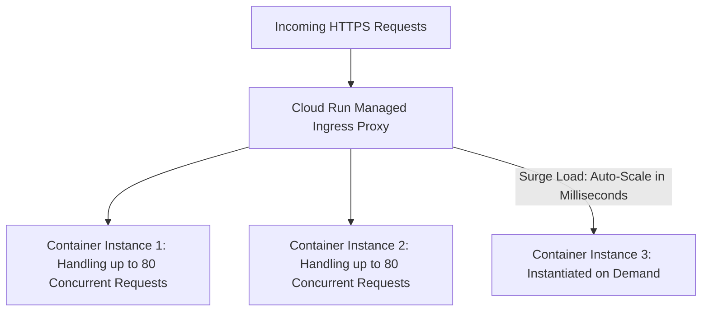

# GCP Cloud Run: Serverless Container Architecture

## Executive Summary

Google Cloud Run is a fully managed serverless platform that executes containerized microservices directly on top of Google's Borg infrastructure. It combines the developer velocity of FaaS with the runtime flexibility of standard Docker containers.

---

## 1. Cloud Run Architecture & Request Concurrency

---

## 2. Why Cloud Run Dominates Enterprise FaaS

- **High Request Concurrency**: Unlike AWS Lambda which allocates one entire container/microVM per concurrent request, a single Cloud Run instance can process up to **250 concurrent requests simultaneously**, drastically reducing cold starts and infrastructure costs.
- **Any Language / Any Binary**: Runs any standard OCI container image listening on `$PORT`. No vendor-proprietary SDK wrappers or runtime dependencies.
- **Serverless VPC Access**: Connects privately to Cloud SQL, Redis, and internal GKE microservices over Direct VPC Egress with zero public IP exposure.
