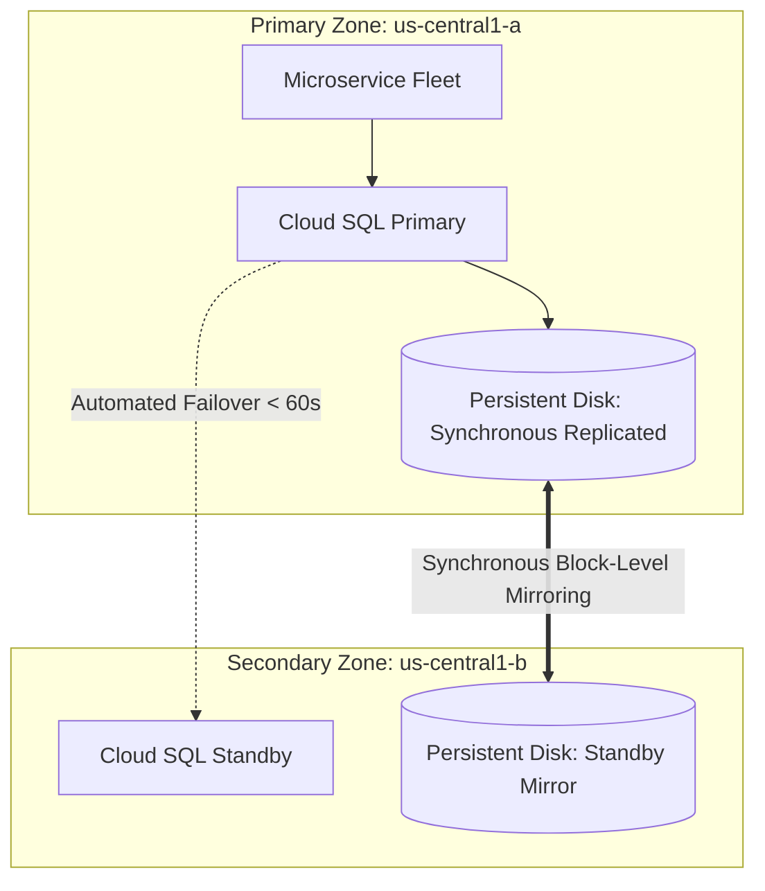

# GCP Relational Databases: Cloud SQL

## Executive Summary

Google Cloud SQL is a fully managed relational database service supporting PostgreSQL, MySQL, and SQL Server.

---

## 1. High-Availability Architecture

---

## 2. Cloud SQL Enterprise Plus Edition

For mission-critical enterprise workloads, select **Enterprise Plus**:
- **Data Cache**: Utilizes local NVMe SSDs to automatically cache hot relational data pages, delivering up to **3x read throughput** and reducing latency by 50%.
- **Maintenance Downtime**: Minimizes planned maintenance downtime to sub-10 seconds using fast failover orchestration.
- **99.99% Availability SLA**: Guaranteed multi-zone availability including scheduled maintenance windows.
