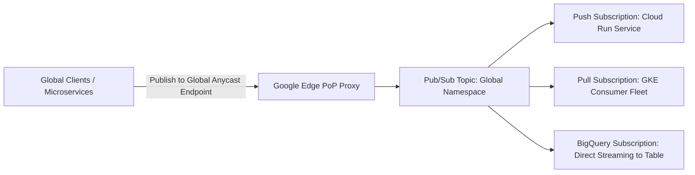

# GCP Global Messaging Architecture: Cloud Pub/Sub

## Executive Summary

Google Cloud Pub/Sub is a fully managed, real-time global messaging service that provides many-to-many, asynchronous messaging with automatic provisioning, elastic scaling, and global Anycast endpoints.

---

## 1. Global Ingestion & Routing Architecture

---

## 2. Core Architectural Patterns

1. **Ordering Keys (Strict In-Order Delivery)**:
   - Pub/Sub delivers messages out-of-order by default to maximize throughput. When strict ordering is required, attach an `ordering_key` (e.g., `account_id`). Pub/Sub guarantees sequential delivery for all messages sharing the identical ordering key.
2. **BigQuery & Cloud Storage Subscriptions (Zero-Code Pipelines)**:
   - Ingest streaming events directly into BigQuery tables or GCS buckets without writing, deploying, or maintaining custom consumer worker code or Dataflow pipelines.
3. **Dead-Letter Topics**:
   - Configure dead-letter topics with `max_delivery_attempts = 5` to isolate unprocessable or poisonous payloads automatically.
