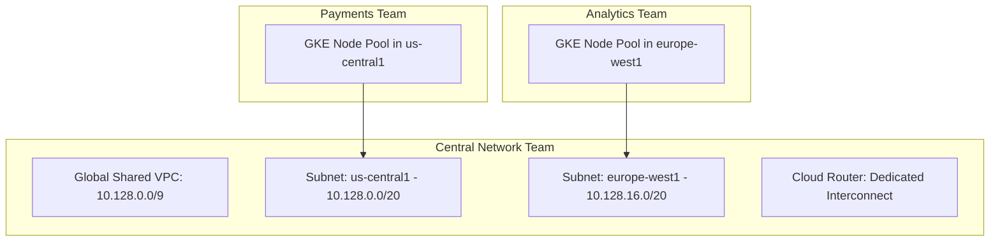

# GCP Networking Architecture: Global VPC & Private Service Connect

## Executive Summary

Unlike AWS and Azure where virtual networks are regional constructs, **GCP VPCs are natively global**. A single GCP VPC spans every physical region worldwide without complex multi-region peering meshes.

---

## 1. Shared VPC Architecture

---

## 2. Private Service Connect (PSC)

GCP **Private Service Connect** allows consumers to privately access managed GCP services (BigQuery, Cloud Storage) or third-party SaaS services inside their VPC using internal IP addresses, completely bypassing the public internet and eliminating public NAT gateway egress.
