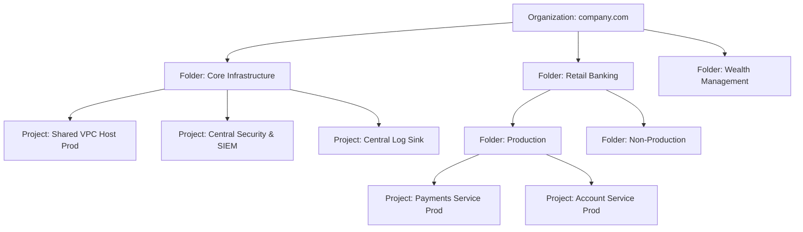

# GCP Resource Hierarchy: Organizations, Folders & Projects

## Executive Summary

Google Cloud organizes all resources in a strict tree hierarchy: **Organization $\rightarrow$ Folders $\rightarrow$ Projects $\rightarrow$ Resources**. In enterprise GCP architecture, the **Project** is the fundamental boundary for billing, IAM permissions, network attachment, and quota allocation.

---

## 1. Enterprise Resource Hierarchy Blueprint

---

## 2. Inheritance & Policy Architecture

- **IAM Policy Inheritance**: IAM permissions flow strictly downwards. An IAM binding applied at the Organization or Folder level cannot be revoked at the Project level.
- **Organization Policy Service**: Enforce guardrails across the entire tree:
  - `constraints/compute.restrictPublicIp`: Denies public IP allocation across all VM instances.
  - `constraints/gcp.resourceLocations`: Restricts resource creation to approved geographic boundaries (e.g., `in:eu-locations` for GDPR).
  - `constraints/iam.disableServiceAccountKeyCreation`: Prohibits downloading exported JSON service account keys.
