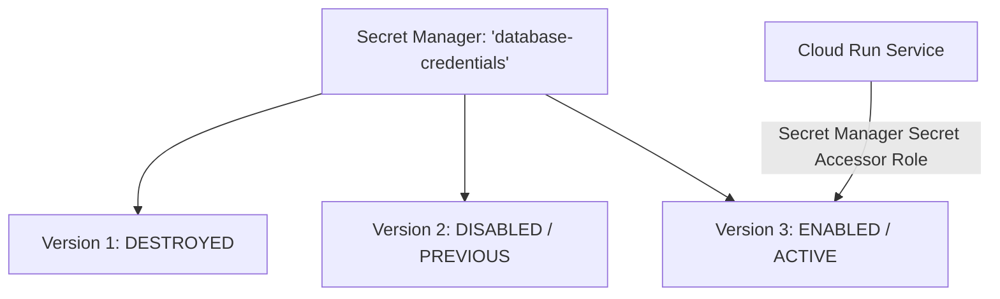

# GCP Security: Secret Manager & Cloud KMS

## Executive Summary

Google Cloud Secret Manager and Cloud KMS provide centralized secret storage and cryptographic key management.

---

## 1. Secret Lifecycle & Versioning Architecture

---

## 2. Customer-Managed Encryption Keys (CMEK)

- **Default Encryption**: All data at rest in GCP is encrypted by default using Google-owned and Google-managed keys (AES-256).
- **CMEK**: For regulatory compliance (FIPS 140-2 Level 3), configure services (BigQuery, GCS, Compute Engine) to encrypt data using keys managed inside **Cloud KMS** owned by the customer.
- **Automatic Key Rotation**: Schedule cryptographic key rotation every 90 days. Cloud KMS automatically uses the latest primary key version for new writes while seamlessly decrypting historical data with older key versions.
