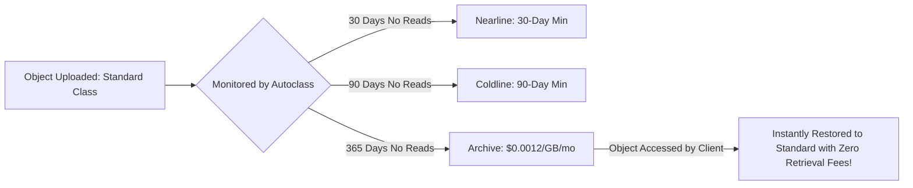

# GCP Storage Architecture: Google Cloud Storage (GCS)

## Executive Summary

Google Cloud Storage (GCS) provides globally unified, durable object storage. It offers high-throughput consistent reads and writes with multi-region and dual-region availability options.

---

## 1. Storage Location Types & Durability

| Location Type | Description | Uptime SLA | Target Workload |
| :--- | :--- | :--- | :--- |
| **Region** | Redundant across Availability Zones within one geographic area (e.g., `us-central1`). | 99.95% | Microservice attachments, local analytics, lowest latency |
| **Dual-Region** | Replicated across two specific regional pairs (e.g., `nam4` - Iowa & South Carolina). | 99.99% | Business-critical analytics with strict cross-region DR mandates |
| **Multi-Region** | Replicated across an entire continent (e.g., `us` or `eu`). | 99.95% | Global content distribution, cross-continental backup archives |

---

## 2. Automated Lifecycle Management with Autoclass

> **Autoclass Architectural Advantage**: Unlike traditional lifecycle policies that charge punishing retrieval and transition fees when cold objects are read, GCS Autoclass eliminates transition fees and automatically promotes accessed data back to Standard storage.
