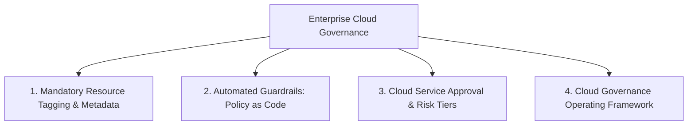

# Cloud Governance Architecture

## Executive Summary

Cloud governance provides the automated policies, resource guardrails, financial tags, and service approval workflows required to manage enterprise cloud consumption safely and economically.

---

## Governance Pillars

---

## Deliverables & Guides

| Document | Focus Area | Architectural Impact |
| :--- | :--- | :--- |
| **[Resource Tagging Standards](resource-tagging-standards.md)** | Metadata taxonomy | Mandatory tags: CostCenter, Owner, Environment, Classification |
| **[Guardrails & Service Approval](guardrails-and-service-approval.md)**| Service authorization | Managing risk tiers, approved cloud services, exception handling |
| **[Cloud Governance Framework](cloud-governance-framework.md)** | Operating framework | Comprehensive enterprise governance operating framework |
