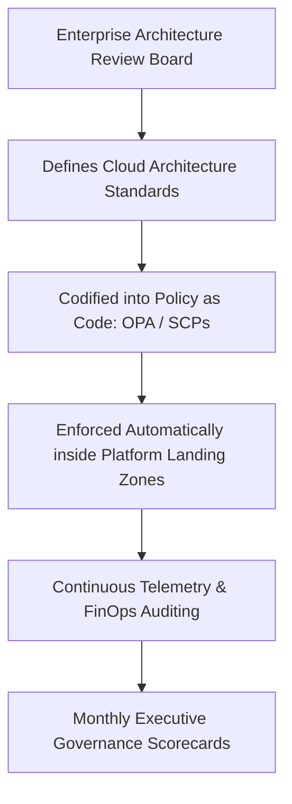

# Cloud Governance Framework

```yaml
status: approved
decision_type: framework
scope: enterprise-cloud-governance
owners: enterprise-architecture-board
review_cadence: annual
```

## Executive Summary

This framework synthesizes architectural governance across financial accountability, security compliance, operational stability, and risk mitigation.

---

## 1. Governance Operating Model



---

## 2. Governance Invariants
1. **Automated Enforcement**: If a governance policy is not enforced by code (SCP, Azure Policy, CI/CD linter), it does not exist.
2. **Cost Accountability**: 100% of enterprise cloud spend must be allocated to specific business cost centers via mandatory tagging.
3. **Continuous Auditing**: Quarterly architecture reviews verify that production systems continue to align with enterprise NFRs and exit strategies.
