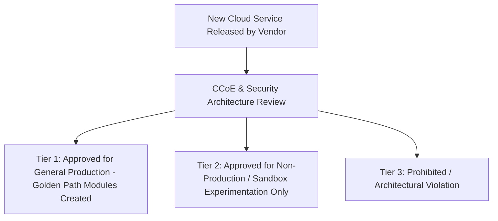

# Cloud Service Approval & Guardrail Governance

## Executive Summary

Cloud providers release hundreds of new services annually. Enterprises must establish a structured evaluation pipeline to approve cloud services safely without paralyzing engineering velocity.

---

## 1. Cloud Service Approval Tiers

---

## 2. The Exception Management Protocol
- When an engineering team requires an unapproved service or temporary policy relaxation (e.g., public S3 bucket for a public marketing campaign), they submit an **Architecture Exception Request (AER)**.
- All AERs must define:
  1. Business justification and financial impact.
  2. Compensating security controls.
  3. Strict expiration date (maximum 90 days), after which the exception automatically terminates.
