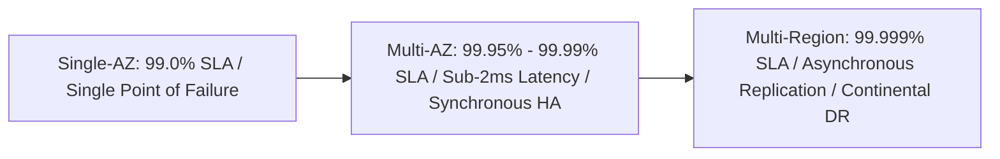

# High Availability Architecture: Intra-Region & Multi-Region Resilience

## Executive Summary

High Availability (HA) ensures that a system remains operational and accessible during component failures, localized datacenter disasters, and network disruptions without human intervention.

---

## High Availability Spectrum

---

## Deliverables & Guides

| Document | Focus Area | Architectural Impact |
| :--- | :--- | :--- |
| **[Single-AZ vs Multi-AZ](single-az-vs-multi-az.md)** | Intra-region resilience | Multi-AZ active-active, quorum architectures, sub-2ms latency |
| **[Multi-Region HA](multi-region-ha.md)** | Geographic availability | Active-active vs active-passive, cross-region replication lag |
| **[Stateless vs Stateful HA](stateless-vs-stateful-ha.md)** | State decoupling | Scaling stateless compute vs distributed stateful clustering |
| **[Quorum & Split-Brain](quorum-and-split-brain.md)** | Distributed consensus | Raft/Paxos consensus, split-brain mitigation, fencing tokens |
| **[Availability vs Reliability vs Resilience](availability-vs-reliability-vs-resilience.md)**| Conceptual taxonomy | Availability != Reliability != Resilience != Disaster Recovery |
