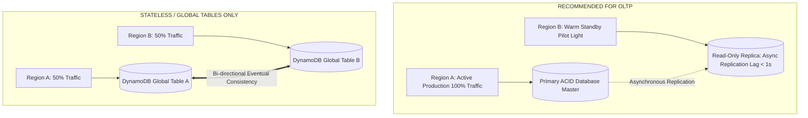

# Multi-Region High Availability Architecture

## Executive Summary

Multi-region architectures distribute applications across distant geographic territories to survive catastrophic regional failures or satisfy strict data residency regulations.

---

## 1. Active-Active vs Active-Passive Multi-Region

---

## 2. The Speed of Light Constraint
- Continental cross-region latency is bounded by physics ($60 - 80\text{ ms}$ round-trip time).
- Attempting synchronous cross-region commits stalls transactional databases. Multi-region architectures **must embrace asynchronous replication and eventual consistency**.
