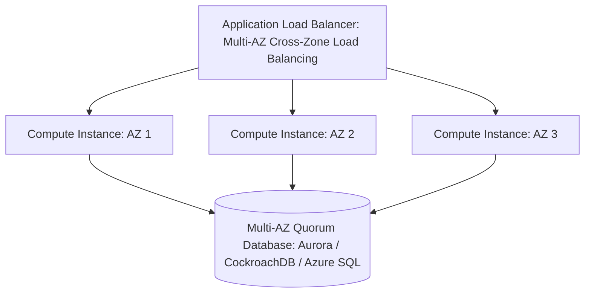

# Single-AZ vs Multi-AZ Architecture

## Executive Summary

An Availability Zone (AZ) is an independent failure domain. Deploying workloads across a minimum of **three Availability Zones** is the foundational baseline for enterprise cloud high availability.

---

## 1. Multi-AZ Active-Active Topology

---

## 2. Why 3 AZs Are Mandatory (The Quorum Problem)
- In a 2-AZ deployment, if the network link between AZ1 and AZ2 is severed, neither zone can determine whether the other zone crashed or if a network partition occurred. A 2-node cluster cannot establish an odd-numbered majority quorum ($2N + 1$).
- **Rule**: Deploy distributed datastores and orchestrators (etcd, ZooKeeper, Aurora storage) across a **minimum of 3 AZs**. If AZ1 fails, AZ2 and AZ3 maintain a $66\%$ majority quorum, continuing uninterrupted operations.
