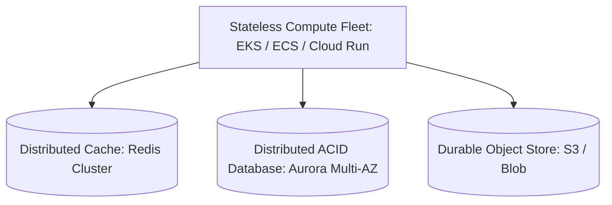

# Stateless vs Stateful High Availability Architecture

## Executive Summary

High availability is trivial for stateless compute fleets and exceptionally complex for distributed stateful datastores.

---

## 1. Decoupling State from Compute

---

## 2. HA Patterns Comparison

| Architectural Layer | HA Strategy | Failure Recovery Mechanism |
| :--- | :--- | :--- |
| **Stateless Compute (API / Web)**| Multi-AZ autoscaling fleet behind L7 Load Balancer | Unhealthy instances terminated; replaced in seconds. |
| **In-Memory Cache (Redis)** | Redis Cluster with primary and replicas across 3 AZs | Automated failover promotes replica in $< 15\text{ seconds}$. |
| **Relational Database (PostgreSQL)**| Log-structured distributed shared storage (Aurora) | Reader promoted to writer in $< 30\text{ seconds}$; zero data loss. |
| **Message Queues (Kafka / SQS)** | Multi-AZ partition replication (Min In-Sync Replicas: 2) | Consumers rebalance automatically to active partition leaders. |
