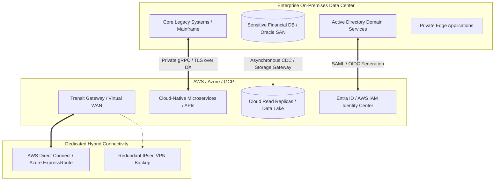

# Hybrid Cloud Architecture

## Executive Summary

Hybrid Cloud is the operational state of integrating private data centers, colocation facilities, and on-premises infrastructure with one or more public cloud environments. In global enterprises, hybrid cloud is rarely a temporary transitional phase—it is a permanent, strategic architectural reality dictated by regulatory compliance, data gravity, hardware investments, and latency constraints.

---

## Architecture Blueprint

---

## Core Deliverables & Guides

| Document | Focus Area | Architectural Impact |
| :--- | :--- | :--- |
| **[Architecture Reference](architecture.md)** | Hybrid cloud reference topology | Data flow, blast radius, transit hubs, security zones |
| **[Datacenter Integration](datacenter-integration.md)** | Facility and edge physical bridging | Colocation, hardware cross-connects, edge appliances |
| **[Hybrid Networking](hybrid-networking.md)** | Dedicated circuits & routing | Direct Connect, ExpressRoute, BGP routing, MTU, dual-path HA |
| **[Identity Federation](identity-federation.md)** | Unified hybrid identity | AD DS to Entra ID/Cloud IAM, Kerberos translation, SSO |
| **[Data Synchronization](data-synchronization.md)** | Moving data across hybrid links | Storage gateways, CDC replication, Kafka bridges, egress costs |
| **[Hybrid Databases](hybrid-databases.md)** | Distributed data topologies | Cross-WAN read replicas, split writes, CAP theorem constraints |
| **[Hybrid Messaging](hybrid-messaging.md)** | Event and message bridging | IBM MQ / RabbitMQ to SQS / EventBridge / Cloud Pub/Sub |
| **[Cloud Bursting](cloud-bursting.md)** | Dynamic capacity bursting | When bursting works (batch) vs why stateful bursting fails |
| **[Legacy Integration](legacy-integration.md)** | Modernizing without breaking legacy| Anti-corruption layers, mainframe bridges, transaction boundaries |
| **[Hybrid Decision Framework](hybrid-cloud-decision-framework.md)**| Measurable architecture framework | Determining when hybrid is essential vs operational anti-pattern |
