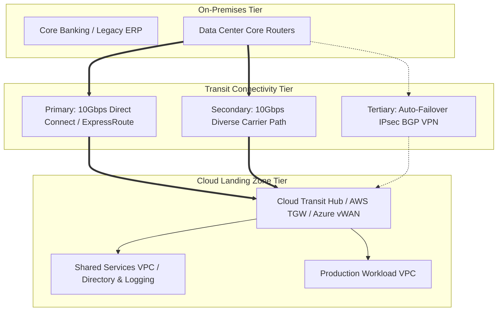

# Hybrid Cloud Reference Architecture

## Executive Summary

This reference architecture provides the foundational blueprint for connecting an on-premises enterprise data center with hyperscale cloud environments while maintaining strict network segmentation, low-latency communication, and high availability.

---

## 1. Multi-Tier Hybrid Topology

---

## 2. Core Architectural Pillars

1. **Non-Overlapping IP Subnet Topology**:
   - Enterprise data centers must maintain a strictly partitioned IP plan.
   - Example: On-premises data center allocated `10.0.0.0/12`; Cloud Landing Zone allocated `10.16.0.0/12`.
   - Never allow overlapping RFC 1918 CIDR blocks; NAT translation (CGNAT/SNAT) across hybrid circuits introduces latency jitter and breaks end-to-end tracing.
2. **Deterministic Dual-Path Routing via BGP**:
   - Configure Border Gateway Protocol (BGP) with AS-Path prepending and BGP Local Preference to ensure primary traffic flows over dedicated fiber, failing over automatically to the secondary path within sub-second detection windows (BFD - Bidirectional Forwarding Detection).
3. **Defense-in-Depth Inspection Zone**:
   - Traffic arriving from the cloud into the data center must pass through dedicated Next-Generation Firewalls (NGFW) with intrusion detection (IDS/IPS) and stateful packet inspection.
