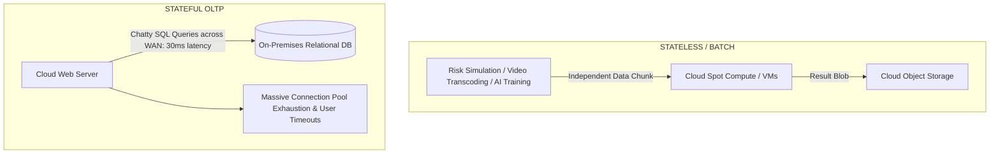

# Cloud Bursting: Feasibility and Anti-Patterns

## Executive Summary

Cloud bursting is an architecture pattern where an on-premises data center runs baseline workloads and dynamically "bursts" excess traffic into public cloud compute during demand spikes. While appealing in theory, **stateful cloud bursting is an enterprise anti-pattern**.

---

## 1. The Reality of Cloud Bursting

---

## 2. Feasibility Evaluation

| Workload Characteristic | Bursting Feasibility | Architectural Rationale |
| :--- | :--- | :--- |
| **Stateless Batch Compute (Simulations, Rendering)** | **High** | Input datasets are staged asynchronously; workers process data locally without chatty database dependencies. |
| **Public Web Frontend with API Backend** | **Moderate** | Edge CDN caches static assets; APIs route back to DC; requires strict rate limiting. |
| **Stateful OLTP Transactions** | **IMPOSSIBLE / PROHIBITED**| Cloud app instances querying an on-premises database across a WAN link face a $30\text{ ms}$ latency penalty per SQL query, causing thread starvation. |
