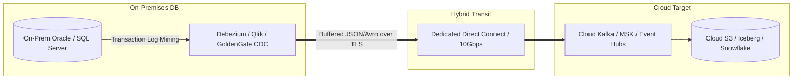

# Hybrid Data Synchronization Architecture

## Executive Summary

Data synchronization across hybrid cloud environments must navigate the fundamental constraints of the speed of light, bandwidth saturation, and network egress fees. Architects must decouple transactional processing from analytical synchronization.

---

## 1. Hybrid Data Flow Patterns

---

## 2. Synchronization Mechanisms

1. **Log-Based Change Data Capture (CDC)**:
   - Never use scheduled batch SQL queries (`SELECT * WHERE updated_at > ?`) across hybrid links; this creates massive database lock contention and misses hard deletes.
   - Read transaction write-ahead logs (WAL) asynchronously using Debezium or Oracle GoldenGate and stream changes to cloud Kafka topics.
2. **Hybrid Storage Gateways**:
   - Deploy local caching appliances (AWS Storage Gateway, Azure File Sync) to expose cloud object storage as local NFS/SMB shares with automated local caching for active working sets.
3. **Data Compression & Serialization**:
   - Always serialize data using binary formats (Apache Avro, Protobuf, Parquet) with compression (zstandard, snappy) before transmitting across hybrid circuits. This reduces bandwidth consumption and egress costs by 70–80%.
