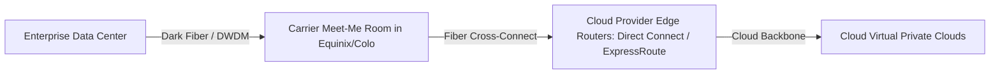

# Datacenter and Colocation Integration

## Executive Summary

Physical integration between corporate data centers or colocation facilities (e.g., Equinix, Digital Realty) and cloud provider network edges requires careful hardware, cabling, and protocol planning.

---

## 1. Colocation Interconnect Topologies

### Physical Integration Considerations
1. **Diverse Carrier Routing**: Never route primary and secondary dedicated circuits through the same physical conduit or municipal telecommunications duct. A backhoe cutting fiber outside the building must not sever both redundant circuits.
2. **Hardware Specifications**: Enterprise edge routers (e.g., Cisco ASR, Juniper MX) must support 100Gbps interfaces, 802.1Q VLAN trunking, and MACsec encryption at wire speed.
3. **Edge Compute Appliances**: Where microsecond processing is required (e.g., automated factory floors or hospital imaging), deploy hybrid appliances (AWS Outposts, Azure Stack Hub, Google Distributed Cloud Edge) connected directly to local SAN arrays.
