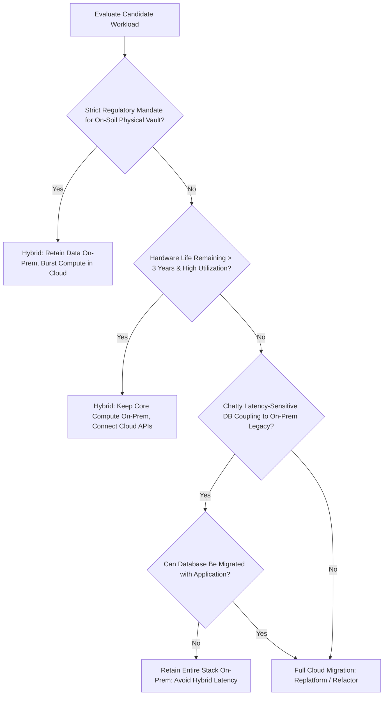

# Hybrid Cloud Decision Framework

```yaml
status: approved
decision_type: framework
scope: enterprise-hybrid-cloud
owners: architecture-review-board
review_cadence: annual
```

## Executive Summary

This framework establishes whether a workload should be architected in a hybrid topology or consolidated into a single operating environment (pure cloud or pure on-premises).

---

## 1. Decision Flowchart



---

## 2. Architectural Decision Matrix

| Architectural Driver | Choose Hybrid Topology | Avoid Hybrid (Go Pure Cloud or Pure On-Prem) |
| :--- | :--- | :--- |
| **Data Gravity & Mainframes** | Systems tightly coupled to high-throughput mainframe backends that cannot be migrated within 24 months. | Autonomous, self-contained microservices with zero legacy back-office coupling. |
| **Regulatory Compliance** | Banking secrecy or patient health laws requiring sensitive cryptographic keys or core ledgers to remain on physical premises. | Standard commercial applications where cloud SOC2/FedRAMP certifications satisfy auditors. |
| **Network Egress Economics** | Workloads processing terabytes of data generated on-premises with only summary metrics exported to cloud. | Workloads that would require continuous multi-terabyte bi-directional replication across hybrid links. |
| **Operational Staffing** | Enterprise maintains mature teams in both data center virtualization and modern cloud engineering. | Small engineering team unable to manage two completely disparate operational toolchains. |
