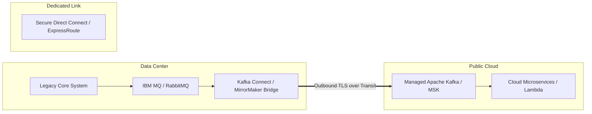

# Hybrid Messaging & Event Streaming Architecture

## Executive Summary

Bridging legacy message brokers (IBM MQ, TIBCO EMS, RabbitMQ) in on-premises data centers with modern cloud-native event buses (Apache Kafka, AWS SQS/SNS/EventBridge, Azure Service Bus) requires decoupled asynchronous patterns.

---

## 1. Hybrid Event Broker Bridging

---

## 2. Core Architectural Rules

1. **Pull-Based Consumers (Outbound-Only Connections)**:
   - Cloud consumers should never initiate inbound network connections directly into on-premises internal database servers or queues.
   - Deploy lightweight edge bridge agents in the data center that establish outbound TLS connections to cloud endpoints to fetch or push messages.
2. **Schema Registry Enforcement**:
   - Maintain a centralized Schema Registry (e.g., Confluent Schema Registry or AWS Glue Schema Registry) accessible across both environments to ensure backwards-compatible Avro/Protobuf contract enforcement.
3. **Idempotency by Design**:
   - Network reconnects across hybrid circuits inevitably produce duplicate message deliveries. All cloud consumers must implement idempotent processing using deduplication keys stored in DynamoDB or Redis.
