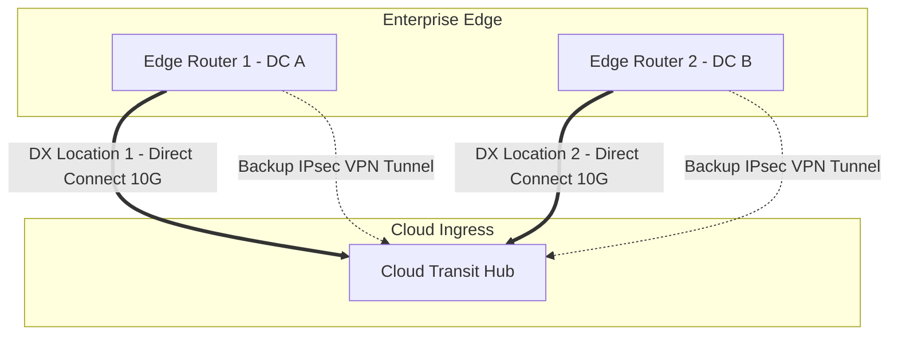

# Hybrid Networking: Dedicated Connectivity vs VPN

## Executive Summary

Hybrid networking establishes the transport pipeline between on-premises and cloud environments. Choosing between **Dedicated Fiber Circuits** (AWS Direct Connect, Azure ExpressRoute, GCP Cloud Interconnect) and **IPsec Site-to-Site VPNs** is driven by throughput, jitter, SLA, and security requirements.

---

## 1. Comparative Architecture Matrix

| Feature / Dimension | Dedicated Circuit (Direct Connect / ExpressRoute) | IPsec Site-to-Site VPN over Public Internet |
| :--- | :--- | :--- |
| **Bandwidth** | 1 Gbps to 100 Gbps dedicated unmetered physical port | Capped at 1.25 Gbps per tunnel (scales via ECMP) |
| **Latency & Jitter** | Deterministic, ultra-low jitter; bypasses public internet | Variable; subject to public ISP congestion and BGP flapping |
| **SLA & Reliability** | 99.9% to 99.99% provider uptime SLA | Best-effort; no provider SLA across the public internet |
| **Encryption** | Optional MACsec (Layer 2) on 10G/100G ports | Mandatory AES-256 IPsec (Layer 3) encapsulation |
| **Lead Time** | Weeks to months (cross-connect provisioning) | Minutes to hours via software configuration |
| **Cost Profile** | High fixed monthly port cost + lower data transfer out fee | Minimal setup cost + standard internet egress rates |

---

## 2. High-Availability Hybrid Network Architecture

### Maximum Resiliency Best Practices
1. **Dual Data Centers + Dual Cloud PoPs**: Terminate circuits in two separate physical cloud colocation facilities to survive a total failure of a carrier exchange building.
2. **MTU Optimization**: Enable Jumbo Frames (MTU 9001) on dedicated Direct Connect/ExpressRoute virtual interfaces to maximize database replication throughput and reduce CPU interrupt overhead.
