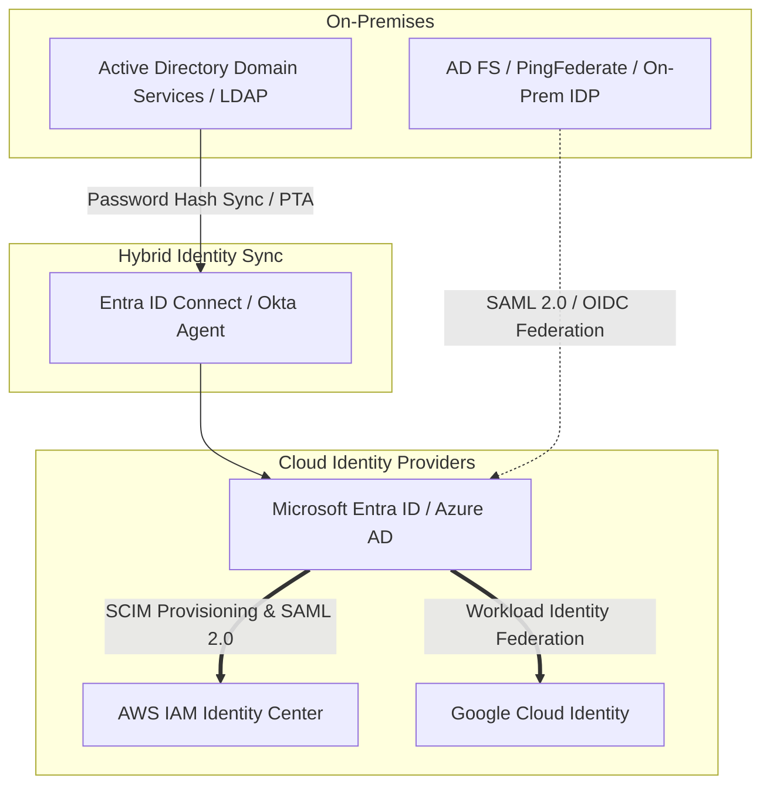

# Hybrid Identity Federation Architecture

## Executive Summary

Identity is the foundational control plane of hybrid cloud. Enterprises must provide seamless, single sign-on (SSO) and centralized access control across on-premises Active Directory and multi-cloud IAM platforms without synchronizing plaintext passwords across network boundaries.

---

## 1. Hybrid Identity Architecture Blueprint

---

## 2. Core Federation Patterns

1. **Password Hash Synchronization (PHS) + Seamless SSO**:
   - Safest and most resilient hybrid pattern. One-way SHA-256 hashes of password hashes are synchronized to Entra ID.
   - Users authenticate against the cloud even if on-premises corporate network links are completely severed.
2. **Pass-Through Authentication (PTA)**:
   - Credentials validated in real time against on-premises domain controllers via lightweight outbound agents.
   - Required by strict regulatory jurisdictions prohibiting password representation from leaving physical data centers.
3. **Workload Identity Federation (Machine-to-Machine)**:
   - Modern replacement for long-lived service account keys.
   - Cloud workloads assume IAM roles by exchanging OIDC JWT tokens issued by on-premises identity providers, eliminating hardcoded credentials in config files.
