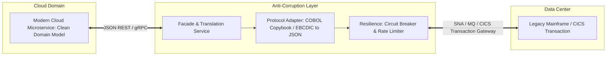

# Legacy System Integration & Anti-Corruption Layers

## Executive Summary

Integrating modern cloud microservices with legacy on-premises mainframes (IBM z/OS, AS/400) or monolithic ERPs (SAP ECC) without compromising cloud agility requires strict isolation boundaries using **Anti-Corruption Layers (ACL)**.

---

## 1. Anti-Corruption Layer Architecture

---

## 2. Architectural Guardrails

1. **Protect Legacy Systems from Cloud Scale**:
   - Mainframes and legacy ERPs are licensed based on MIPS (Millions of Instructions Per Second) and cannot scale elastically. An unexpected cloud traffic surge could exhaust mainframe CPU and result in millions of dollars in penalty licensing fees.
   - Enforce strict token-bucket rate limiting and circuit breaking inside the ACL to shed excess load before it touches legacy backends.
2. **Translate Data Models at the Boundary**:
   - Never allow legacy data structures (e.g., COBOL 88-level condition names, packed decimals, arcane 2-digit abbreviations) to leak into modern cloud services. The ACL must map legacy payloads into clean domain entities.
