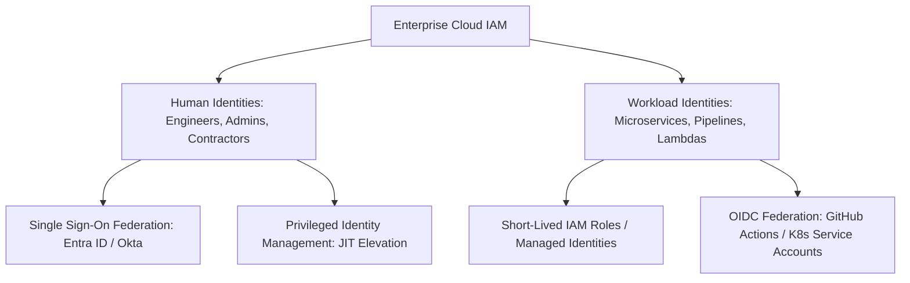

# Enterprise IAM Architecture: Identity as the Primary Perimeter

## Executive Summary

In cloud computing, **Identity is the primary security perimeter**. Identity and Access Management (IAM) governs how human engineers and automated machine workloads establish identity and acquire permissions to execute actions against cloud APIs.

---

## IAM Architecture Taxonomy

---

## Deliverables & Guides

| Document | Focus Area | Architectural Impact |
| :--- | :--- | :--- |
| **[Human vs Workload Identity](human-vs-workload-identity.md)** | Identity taxonomy | Human interactive SSO vs Machine workload federation |
| **[Federation & SSO](federation-and-sso.md)** | Directory integration | SAML 2.0, OIDC, SCIM user provisioning, Entra ID / Okta |
| **[RBAC vs ABAC](rbac-vs-abac.md)** | Authorization models | Role-Based vs Attribute-Based Access Control |
| **[Least Privilege Engineering](least-privilege-engineering.md)** | Permission scoping | Access Analyzer, permission boundaries, JIT access |
| **[Cross-Boundary Access](cross-boundary-access.md)** | Multi-tenant authorization | Cross-account trust policies, cross-subscription access |
| **[IAM Architecture Decision Framework](iam-architecture-decision-framework.md)**| Measurable governance framework | Quantitative scorecard for IAM policy and architecture design |
