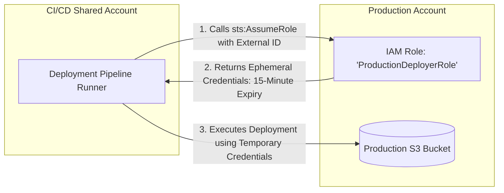

# Cross-Account & Cross-Subscription IAM Architecture

## Executive Summary

Enterprise multi-account landing zones require workloads in one cloud account (e.g., CI/CD Pipeline Account) to interact with resources in another (e.g., Production Account).

---

## 1. Secure Cross-Account Role Assumption



---

## 2. Preventing The Confused Deputy Attack

- When establishing cross-account trust policies for third-party SaaS vendors (e.g., Datadog, Databricks), **always enforce a cryptographically unique `ExternalId`**:
```json
"Condition": {
  "StringEquals": {
    "sts:ExternalId": "7a8f9c1b-unique-tenant-uuid"
  }
}
```
*This guarantees that a rogue client of the same SaaS vendor cannot impersonate your role.*
