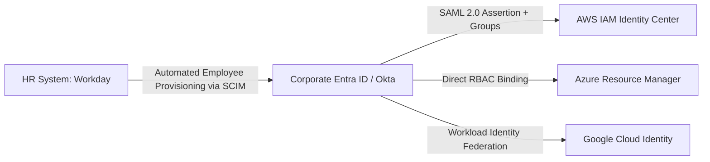

# Identity Federation & Enterprise Single Sign-On (SSO)

## Executive Summary

Enterprise Single Sign-On (SSO) centralizes identity lifecycle management in an authoritative enterprise directory (Microsoft Entra ID, Okta, Ping Identity), federating access into multi-cloud environments.

---

## 1. SAML 2.0 & SCIM Federation Flow

---

## 2. SCIM (System for Cross-domain Identity Management)

- When an employee departs the organization and is deactivated in Workday/Active Directory, **SCIM automatically deprovisions** their access across AWS, Azure, and GCP simultaneously within minutes, eliminating orphaned cloud accounts.
