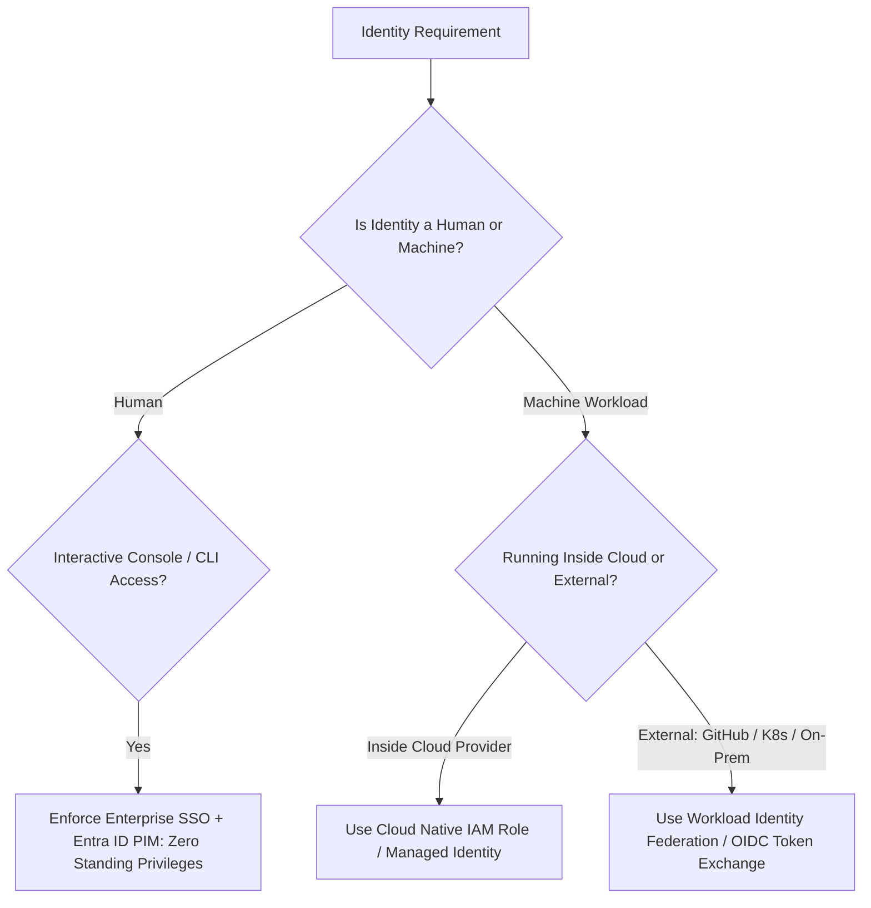

# IAM Architecture Decision Framework

```yaml
status: approved
decision_type: framework
scope: enterprise-iam
owners: cloud-security-board
review_cadence: semi-annual
```

## Executive Summary

This framework governs identity federation, permission scoping, and authentication mechanisms across all enterprise cloud platforms.

---

## 1. The IAM Decision Tree



---

## 2. Security Invariants (Mandatory Rules)

1. **Zero Permanent API Keys**: Generating permanent IAM user access keys (`AKIA...`) or service principal secrets is prohibited. All machine access must use temporary OIDC tokens.
2. **Mandatory MFA for Console**: Interactive cloud console access must require Phishing-Resistant MFA (FIDO2 / WebAuthn / Passkeys).
3. **No Wildcard Permissions in Production**: Policies containing `"Action": "*"` on `"Resource": "*"` are rejected automatically by CI/CD linters.
