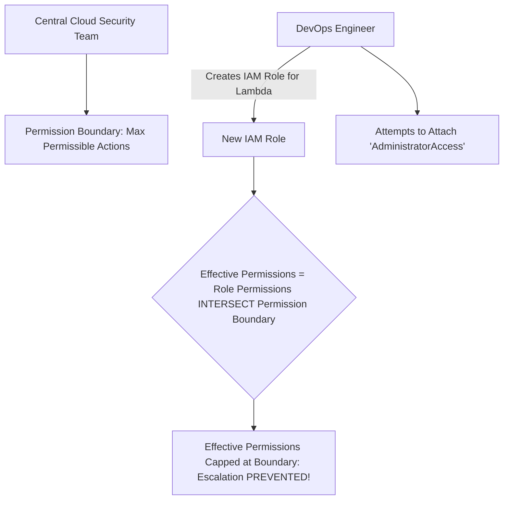

# Least Privilege Engineering & Permission Boundaries

## Executive Summary

Enforcing least privilege requires automated tooling to calculate the exact set of permissions required by workloads and prevent privilege escalation.

---

## 1. IAM Permission Boundaries Architecture

---

## 2. Automated Access Pruning via Access Analyzer

- Deploy **IAM Access Analyzer**: Continuously analyzes CloudTrail logs to identify granted permissions that have never been exercised by a workload over a 90-day window.
- Automatically generate refined, right-sized IAM policies removing unused privileges before promoting services to production.
