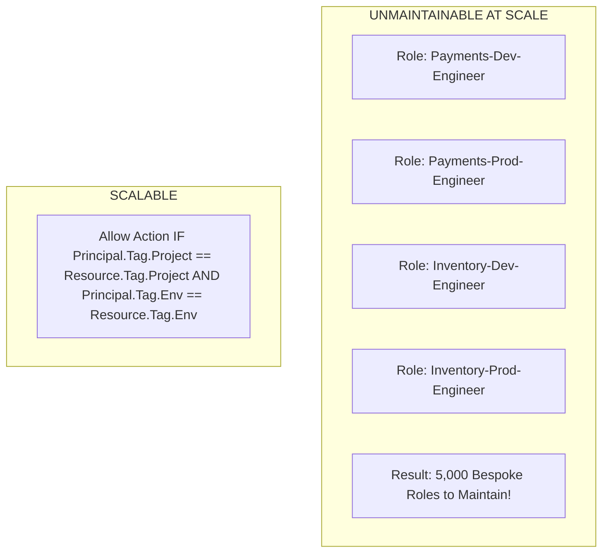

# RBAC vs ABAC: Scaling Enterprise Cloud Authorization

## Executive Summary

As an enterprise grows from tens of microservices to thousands, **Role-Based Access Control (RBAC)** suffers from "role explosion." **Attribute-Based Access Control (ABAC)** solves this by evaluating dynamic metadata attributes.

---

## 1. Role Explosion vs Dynamic ABAC



---

## 2. ABAC Implementation in AWS IAM

```json
{
  "Version": "2012-10-17",
  "Statement": [
    {
      "Effect": "Allow",
      "Action": ["ec2:StartInstances", "ec2:StopInstances"],
      "Resource": "*",
      "Condition": {
        "StringEquals": {
          "aws:ResourceTag/Project": "${aws:PrincipalTag/Project}",
          "aws:ResourceTag/Environment": "${aws:PrincipalTag/Environment}"
        }
      }
    }
  ]
}
```
*A single ABAC policy governs access across thousands of engineers and resources based strictly on resource tags.*
