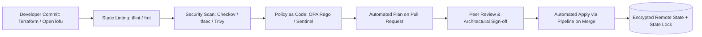

# Infrastructure as Code (IaC) Architecture

## Executive Summary

Infrastructure as Code (IaC) is the practice of defining, provisioning, and managing enterprise cloud infrastructure using declarative, version-controlled machine-readable definition files.

---

## The Enterprise IaC Delivery Pipeline

---

## Deliverables & Guides

| Document | Focus Area | Architectural Impact |
| :--- | :--- | :--- |
| **[IaC Principles](iac-principles.md)** | Core philosophy | Declarative vs Imperative, Idempotency, Immutability |
| **[State Management & Drift](state-management-and-drift.md)**| State integrity | Remote backends, distributed state locking, drift detection |
| **[Module Design Principles](module-design-principles.md)** | Reusability | Semantic versioning, single responsibility, clean contracts |
| **[Policy as Code](policy-as-code.md)** | Automated guardrails | OPA Rego, Kyverno, Sentinel, preventing misconfigurations |
| **[Infrastructure Testing](infrastructure-testing.md)** | Verification strategy | Unit testing (terratest), integration tests, dry-run plans |
| **[IaC & GitOps Relationship](iac-gitops-relationship.md)** | Delivery paradigms | How static IaC pairs with dynamic in-cluster GitOps engines |
