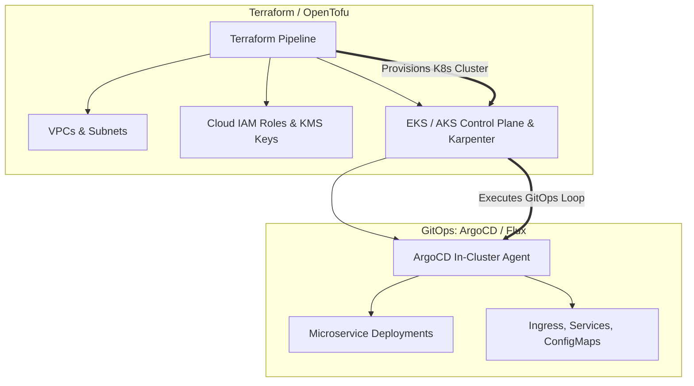

# IaC and GitOps: Complementary Delivery Paradigms

## Executive Summary

Architects often debate "Terraform vs GitOps." In enterprise architecture, **IaC and GitOps are complementary layers of the same delivery pipeline**, operating at different abstraction tiers.

---

## 1. Separation of Concerns: IaC vs GitOps

---

## 2. Architectural Boundary Rule
- **Use Terraform/IaC**: For foundational cloud primitives that live outside the Kubernetes API (VPCs, Transit Gateways, IAM roles, managed databases, KMS keys).
- **Use GitOps (ArgoCD/Flux)**: For application workloads, pod scheduling, and services living inside the Kubernetes cluster.
