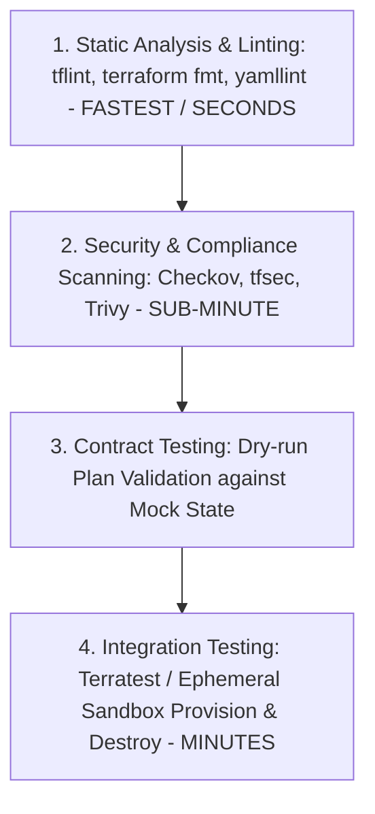

# Infrastructure Testing: Static Analysis, Unit & Integration Testing

## Executive Summary

Treating infrastructure as software requires applying modern software testing methodologies to cloud infrastructure definitions.

---

## 1. The Infrastructure Testing Pyramid

---

## 2. Integration Testing with Terratest (Go)

- **Terratest**: Automates spinning up real infrastructure in an isolated sandbox cloud account, running HTTP/database health queries to verify functionality, and executing `terraform destroy` upon completion.
- **Enterprise Guardrail**: Run Terratest suites in nightly regression pipelines rather than on every commit to manage cloud sandbox costs.
