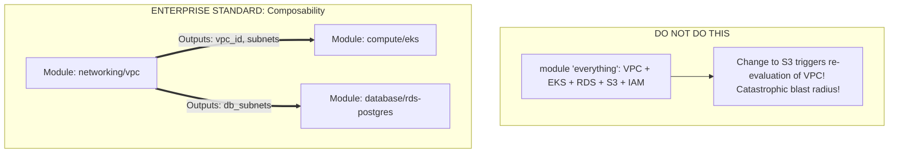

# Enterprise IaC Module Design Principles

## Executive Summary

Well-architected IaC modules reduce code duplication and enforce security baselines across hundreds of development teams. Poorly architected modules become unmaintainable monolithic monsters.

---

## 1. The Single-Responsibility Module Principle

---

## 2. Semantic Versioning & Immutability
- **Pin Module Versions**: Never reference the `main` branch of an IaC module repository (`source = "git::...ref=main"`). If a platform engineer updates `main`, all downstream pipelines break unexpectedly.
- **Strict Semantic Versioning**: Reference immutable semantic release tags (`ref=v2.4.1`). Upgrades must be deliberate, peer-reviewed pull requests.
