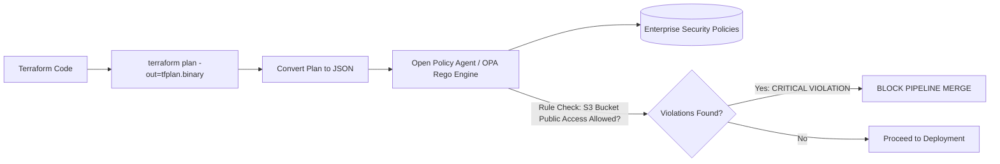

# Policy as Code Architecture: OPA Rego, Sentinel & Kyverno

## Executive Summary

**Policy as Code (PaC)** replaces subjective human architecture reviews with automated, deterministic programmatic policies evaluated inside CI/CD pipelines before infrastructure can be provisioned.

---

## 1. Pre-Deployment Policy Enforcement Pipeline



---

## 2. Production OPA Rego Policy Example

```rego
package enterprise.cloud.s3

# Rule: Deny any S3 bucket that does not enforce server-side encryption
deny[msg] {
    resource := input.resource_changes[_]
    resource.type == "aws_s3_bucket"
    not resource.change.after.server_side_encryption_configuration
    msg := sprintf("Security Violation: S3 bucket '%v' must have server-side encryption enabled.", [resource.address])
}
```
