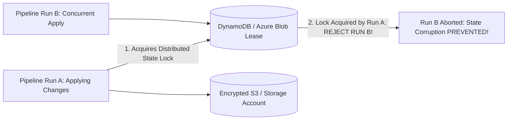

# IaC State Management, Locking & Drift Detection

## Executive Summary

Declarative IaC engines (Terraform, OpenTofu) maintain a **State File** that maps declared code to real-world cloud resource IDs. Protecting state integrity and detecting out-of-band drift are foundational operational responsibilities.

---

## 1. Remote State Locking Architecture

---

## 2. Automated Drift Detection Scheduling

- **The Threat of Drift**: An engineer modifies a firewall rule manually during a midnight incident; the change is forgotten and never codified in Git.
- **Continuous Reconciliation**: Schedule an automated daily or hourly pipeline running `terraform plan -detailed-exitcode`. If state drift is detected, generate an immediate alert in Slack/PagerDuty and trigger an automated reconciliation pull request.
