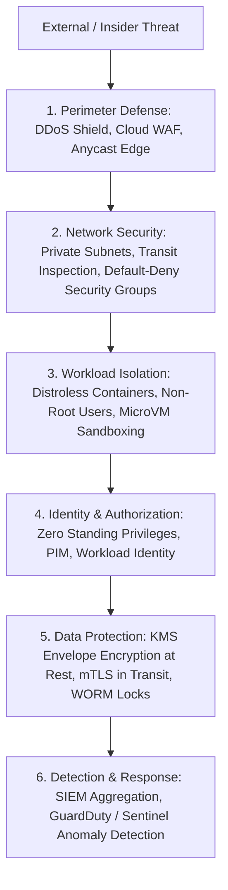

# Cloud Infrastructure Security Architecture

## Executive Summary

Cloud security operates under the assumption of an untrusted physical and network environment. Enterprise infrastructure security enforces a **Defense-in-Depth** strategy where controls are implemented across perimeter, network, host, container, data, and identity tiers.

---

## Defense-in-Depth Layered Architecture

---

## Deliverables & Guides

| Document | Focus Area | Architectural Impact |
| :--- | :--- | :--- |
| **[Defense in Depth](defense-in-depth.md)** | Multi-layered controls | Layered security controls from internet edge to physical data |
| **[Network Segmentation](network-segmentation.md)** | Network micro-segmentation | Zero-trust boundaries, DMZ topologies, isolated compliance enclaves |
| **[Workload Identity](workload-identity.md)** | Machine identity federation | Eliminating service account keys via OIDC JWT token exchange |
| **[Vulnerability Management](vulnerability-management.md)** | Continuous security posture | CVE scanning, golden image pipelines, patch automation |
| **[CSPM & Compliance](cspm-and-compliance.md)** | Posture management & drift | Cloud Security Posture Management, automated policy enforcement |
| **[Security Logging & SIEM](security-logging-monitoring.md)** | Telemetry & threat detection | CloudTrail, Sentinel, GuardDuty, immutable WORM log archiving |
| **[Zero Trust Architecture](zero-trust-architecture.md)** | Identity-centric security | BeyondCorp model, contextual access, continuous verification |
